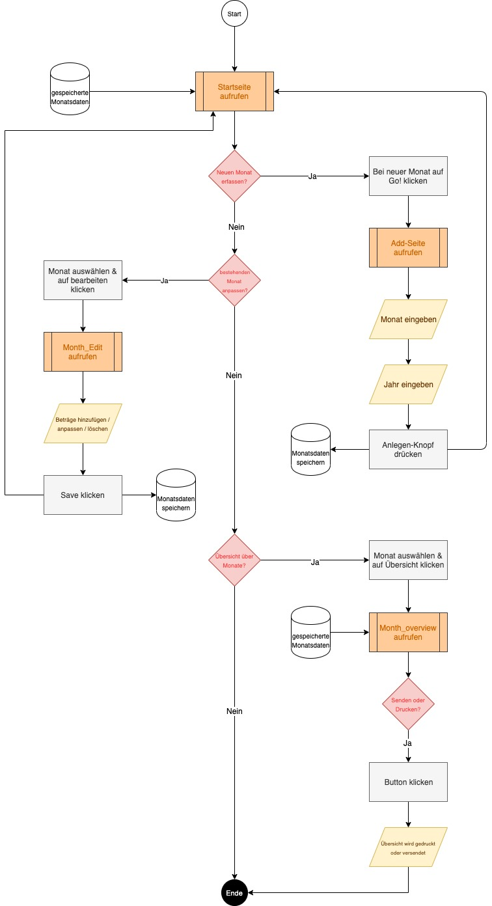

# README - Budget planer

## Ausgangslage
Wer kennt es nicht...am Ende des Monats ist das Konto auf 0 geschrumpft und man weiss nicht wieso? Da wäre eine Übersicht über alle Kosten sehr hilfreich, welche einem motiviert seine Ausgaben zu minimieren, um auch nur einen kleinen Betrag auf sein Sparkonto übertragen zu können. Dies betrifft mich vor allem seit dem ich eine eigene Wohnung habe und nicht mehr 100% arbeite.

## Funktion/Projektidee
Die Idee ist ein Budgetplaner, der einem eine Übersicht über die Fixkosten & -einnahmen, monatlichen Kosten und Einahmen, sowie einem anzeigt welchen Betrag man am Ende des Monats auf sein Sparkonto überweisen kann.

## Workflow
Die genauen Funktionen und den Datenstrom durch das Programm wird nachfolgend detailliert beschrieben.

### Dateneingabe
Man kann einen neuen Monat erfassen oder einen bestehenden Monat bearbeiten. Innerhalb des Monats können dann Kosten und Einnahmen erfasst werden, welche angefallen sind oder anfallen werden. Oder man kann die bereits erfassten Kosten oder Einnahmen bearbeiten.

### Datenverarbeitung/Speicherung
Diese Daten sollen dann gespeichert werden und mit ihnen soll dann der Betrag berechnet werden, welcher am Ende des Monats noch übrig bleibt. Diese veränderten Daten sollen dann auch gespeichert werden und für die Ausgabe zur Verfügung stehen.

### Datenausgabe
Als Ausgabe soll ein übersichtlicher Monatsüberblick erstellt werden, welcher dann ausgedruckt oder per Email versendet werden kann, um dann idealerweise den Endbetrag auf sein Sparkonto übertragen kann.

