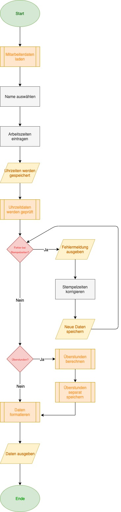

# README

## Ausgangslage
Mein momentaner Arbeitgeber hat ein sehr kompliziertes, zeitfressendes und für den Leien unverständliches Zeriterfassungsprogramm. Mich interessiert es sehr, wie man so ein Programm schreibt und welcher Aufwand dahinter steckt. Auch interessiert es mich, ob ich mit den Fähigkeiten und Grundlagen aus diesem Studium ein solches Programm schreichen könnte. Dafür sah ich diese Semesterarbeit als tolle Chance an.

## Funktion/Projektidee
Somit würde ich als Semesterarbeit gerne eine vereinfachte Zeiterfassung programmieren, welche Daten von Mitarbeitern entgegennimmt, mit diesen Berechnungen durchführt, sie bearbeitet und am Ende schön formatiert ausgibt, sodass es auch für den Mitarbeiter nachvollziehbar & verständlich ist.

## Workflow
Die genauen Funktionen und den Datenstrom durch das Programm wird nachfolgend detailliert beschrieben.

### Dateneingabe
Der Mitarbeiter wählt sein Profil aus. Anschliessend stempelt er ein. Sollte er eine Pause oder Mittag machen muss er aus- und wieder einstempeln. Am Ende des Tages, wenn er seinen Arbeitstag beendet, stempelt er wieder aus.

### Datenverarbeitung/Speicherung
Die Daten werden hier geprüft. Beispiel hierfür: Wenn er an einem Samstag oder Sonntag gearbeitet hat, erhält er einen Zusatz auf seinen Stundenlohn. Anschliessend sollen diese veränderten Daten gespeichert werden.

### Datenausgabe
Diese Daten sollen dann für alle verständlich ausgegeben werden. Dies soll in Form einer Aufstellung auf einer A4 Seite realisiert werden und dem Mitarbeiter sowie dem Unternehmen zur Verfügung stehen.

