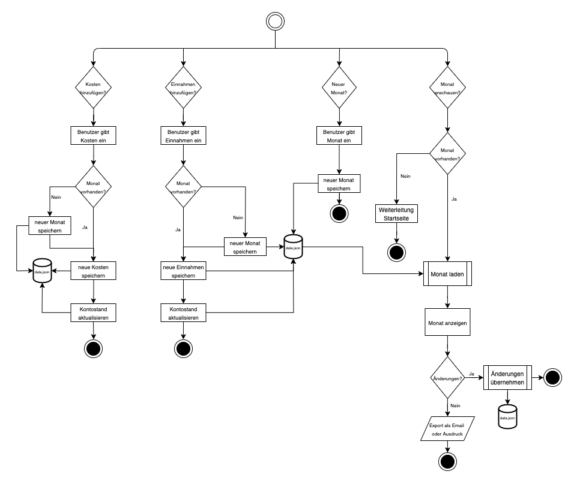

# README - Budget planer

## Ausgangslage
Wer kennt es nicht...am Ende des Monats ist das Konto auf 0 geschrumpft und man weiss nicht wieso? Da wäre eine Übersicht über alle Kosten sehr hilfreich, welche einem motiviert seine Ausgaben zu minimieren, um auch nur einen kleinen Betrag auf sein Sparkonto übertragen zu können. Dies betrifft mich vor allem seit dem ich eine eigene Wohnung habe und nicht mehr 100% arbeite.

## Funktion/Projektidee
Die Idee ist ein Budgetplaner, der einem eine Übersicht über die monatlichen Kosten & Einnahmen gibt, sowie einem anzeigt, welchen Betrag man am Ende des Monats auf sein Sparkonto überweisen kann.

## Workflow
Die genauen Funktionen und den Datenstrom durch das Programm wird nachfolgend detailliert beschrieben.

### Dateneingabe
Man kann auf der Startseite einen neuen Monat erfassen, einen bestehenden Monat anzeigen lassen oder ihn auch komplett löschen. Ausserdem können Kosten und Einnahmen erfasst werden, welche angefallen sind.
In der Übersichtsseite können dann auch die bereits erfassten Kosten oder Einnahmen bearbeitet oder gelöscht werden.

### Datenverarbeitung/Speicherung
Diese Daten werden dann gespeichert und es wird der Betrag berechnet, welcher am Ende des Monats noch übrig bleibt. Diese veränderten Daten sollen dann ebenfalls gespeichert werden und für die Ausgabe zur Verfügung stehen.

### Datenausgabe
Als Ausgabe soll ein übersichtlicher Monatsüberblick erstellt werden, welcher dann ausgedruckt oder per Email versendet werden kann, um dann idealerweise den Endbetrag auf sein Sparkonto zu übertragen.

## Benutzeranleitung
### Neuer Monat hinzufügen
Auf der Startseite wird in dem Abschnitt "Neuer Monat" der gewünschte Monat und das dazugehörige Jahr eingegeben. Anschliessend den Button "Hinzufügen" klicken und der Monat wird hinzugefügt.

### Bestehender Monat als Übersicht
Auf der Startseite wird in dem Abschnitt "Bestehender Monat" der gewünschte Monat und das dazugehörige Jahr eingegeben. Anschliessend den Button "Übersicht" klicken und der Monat wird auf einer neuen Seite als Übersicht angezeigt. Hier werden die Kosten und Einnahmen in getrennten Tabellen dargestellt. Unter diesen beiden ist die Summe ersichtlich, welche dem Benutzer noch zur Verfügung steht. Nun kann diese Übersicht mit einem Klick auf den Button "Print" ausgedruckt werden. Der Betrag in der Summe kann aber auch direkt mit dem Klick auf den Button "Email" an die Emailadresse des Benutzers gesendet werden.

#### Kosten und Einnahmen in der Übersicht bearbeiten oder löschen
In der Übersicht kann in der Zeile der gewünschen Einnahme oder Kosten auf den Button "Bearbeiten" geklickt werden. Hier öffnet sich eine neue Seite mit den Details zu dem jeweiligen Betrags. Nun können die gewünschten Anpassungen vorgenommen werden und auf den Button "Anpassen" geklickt werden. Anschliessend wird man wieder auf die Starseite geleitet.

In der Übersicht kann in der Zeile der gewünschen Einnahme oder Kosten auf den Button "Löschen" geklickt werden, um den jeweiligen Betrag komplett zu entfernen. Anschliessend wird man wieder auf die Starseite geleitet.

### Bestehender Monat löschen
Auf der Startseite wird in dem Abschnitt "Bestehender Monat" der gewünschte Monat und das dazugehörige Jahr eingegeben. Anschliessend den Button "Löschen" klicken und der Monat wird komplett entfernt.

### Einnahmen hinzufügen
Auf der Startseite wird in dem Abschnitt "Einnahmen hinzufügen" der gewünschte Monat, das dazugehörige Jahr, der Betrag und den Titel der Einnahme eingegeben. Sollte der eingegebene Monat noch nicht vorhanden sein, wird er erstellt. Ansonsten werden die Einnahmen einfach zum bestehenden Monat hinzugefügt.

### Kosten hinzufügen
Auf der Startseite wird in dem Abschnitt "Kosten hinzufügen" der gewünschte Monat, das dazugehörige Jahr, der Betrag und den Titel der Ausgabe eingegeben. Sollte der eingegebene Monat noch nicht vorhanden sein, wird er erstellt. Ansonsten werden die Kosten einfach zum bestehenden Monat hinzugefügt.